# Mintmark

**A serious collector's tracker for gold and silver: catalog bullion, coins, and bars; photograph a coin and get grounded catalog identification with candidates and confidence; watch both melt and collectible value against live, source-attributed spot prices.** Built as a production-grade monorepo - ASP.NET Core minimal APIs on .NET 10, PostgreSQL 18 with pgvector, a Next.js 16 web client, and an Expo SDK 57 mobile client with guided two-shot coin capture.

<p align="center">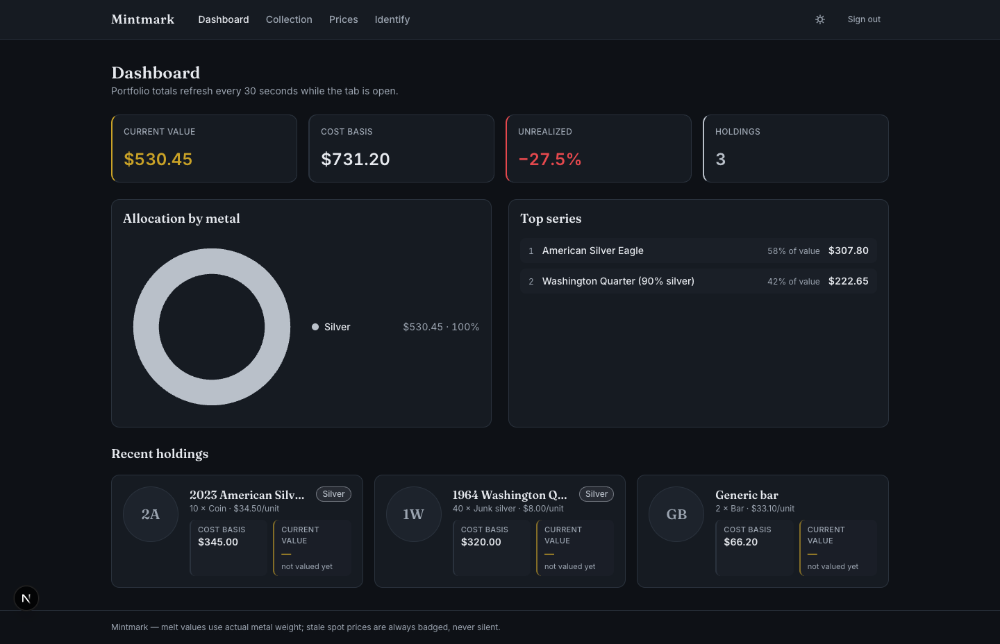</p>

## The product in screenshots

| Landing | Dashboard - live rollup |
|---|---|
| 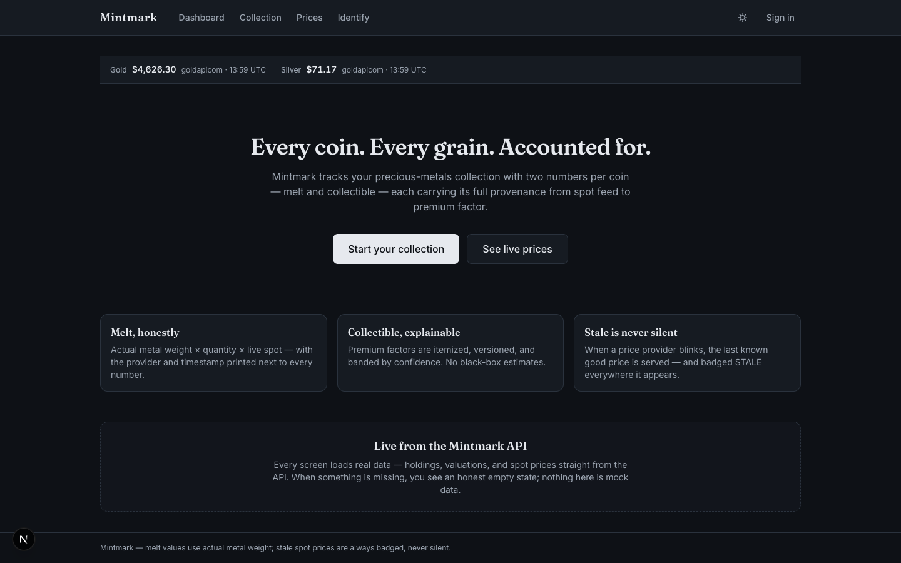 |  |

| Collection - gallery + dense table | Holding detail - provenance + real coin photography |
|---|---|
| 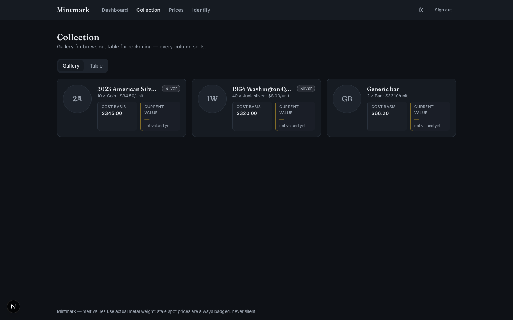 | 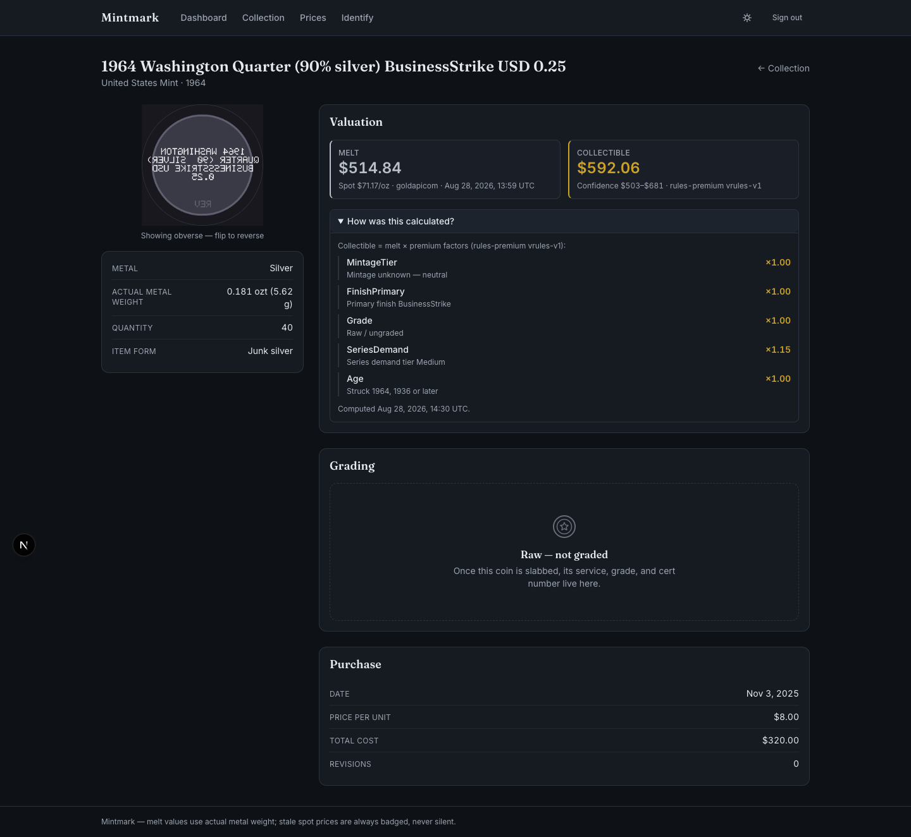 |

| Prices - live charts + Au:Ag ratio | Identify - capture → candidates → confirm |
|---|---|
| 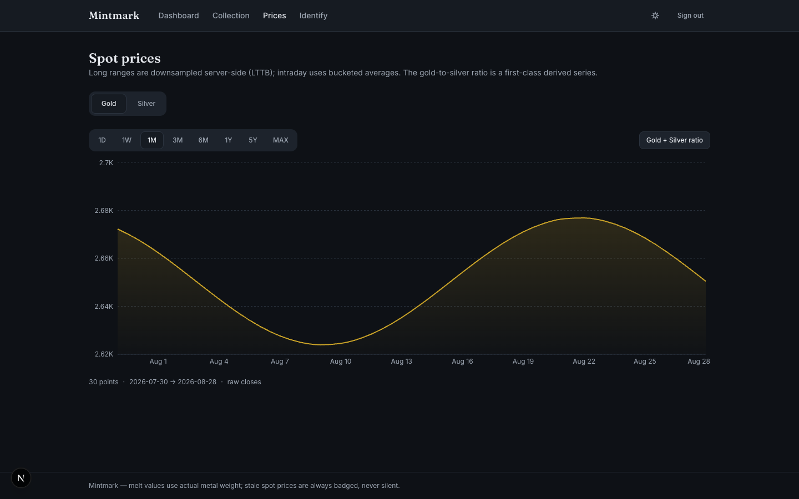 | 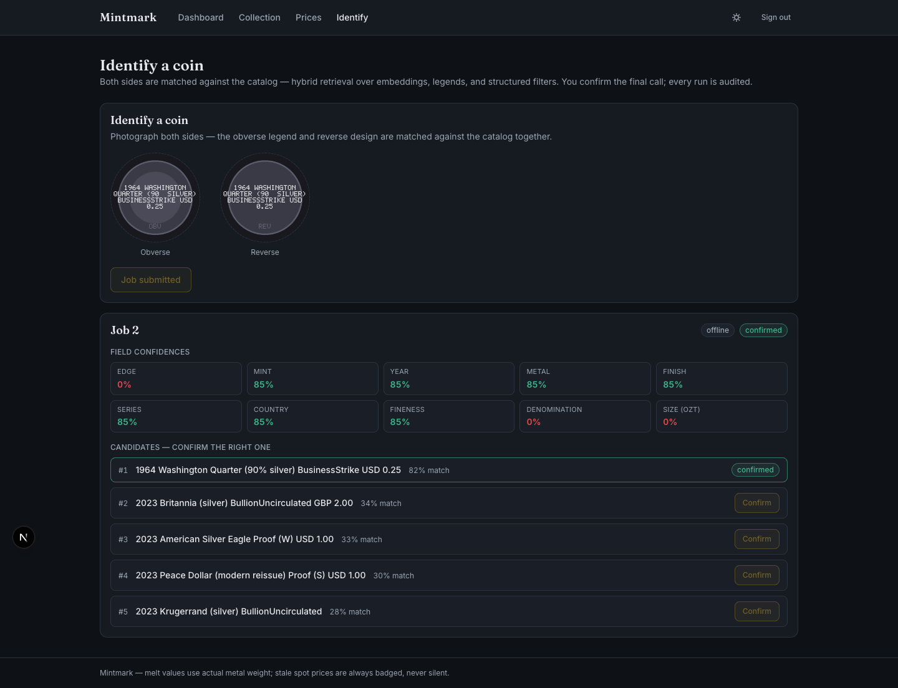 |

The mobile client (Expo SDK 57), captured on a real iOS simulator run -
guided two-shot capture, live portfolio rollup and per-holding valuation,
biometric lock and durable offline queue:

| Mobile - Collection: rollup + live values | Mobile - Holding detail: premium factors |
|---|---|
| 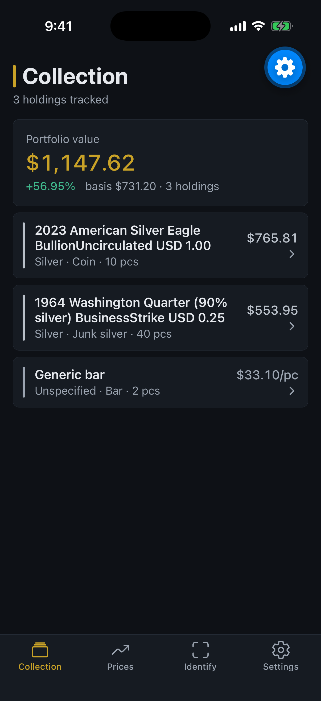 | 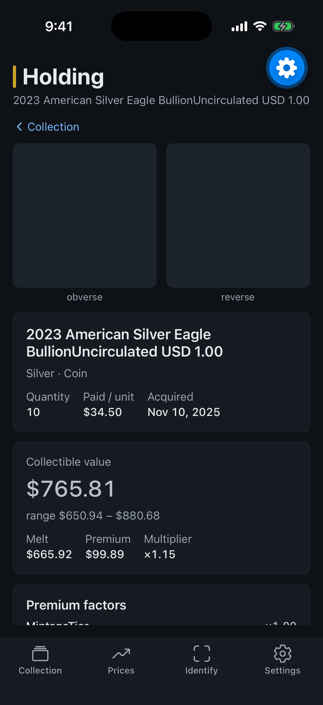 |

| Mobile - Prices: spot + Au:Ag ratio | Mobile - Identify: guided capture |
|---|---|
| 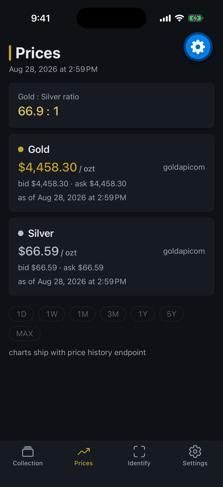 | 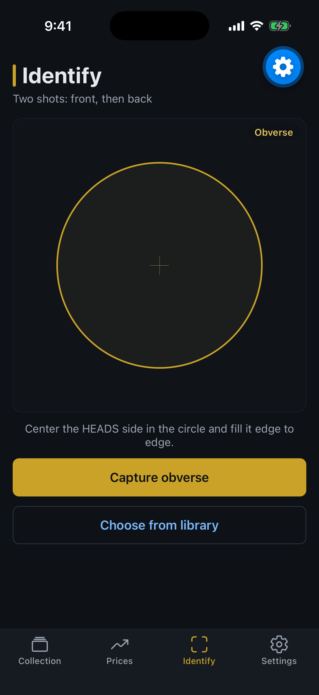 |

| Mobile - Sign in | Mobile - Settings: security + sync |
|---|---|
| 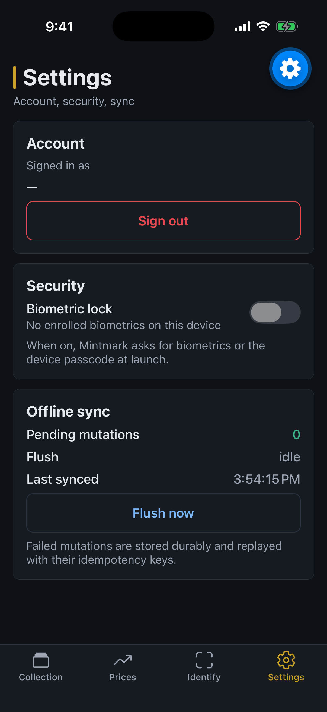 | 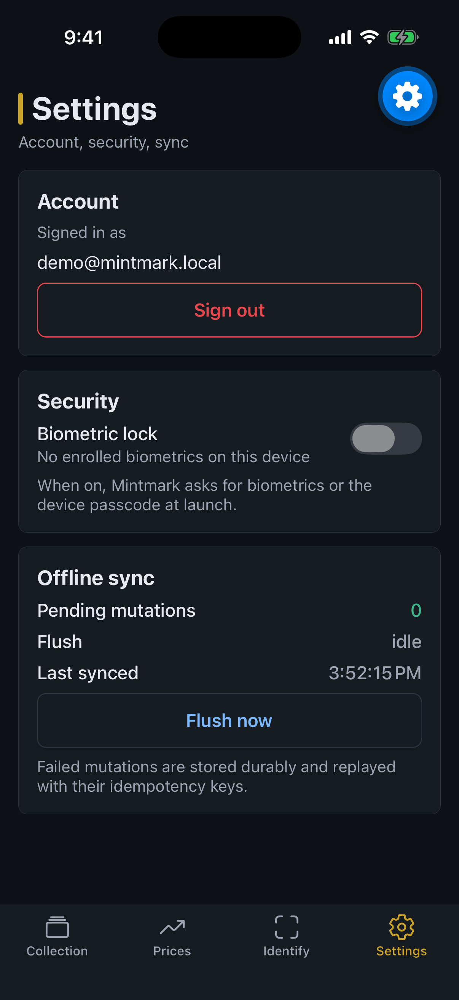 |

Coin imagery in the app is **real photography, freely licensed** - sourced
from Wikimedia Commons and public-domain US Mint renders, every image's
license verified (PD/CC0/CC-BY/CC-BY-SA; no NC/ND) with per-file
attribution in
[backend/seed/images/CREDITS.md](backend/seed/images/CREDITS.md). Rows
without a freely-licensed photograph fall back to original rendered
bullion art (metallic sheen, reeded edges, generic legends - no protected
mint designs), so the retrieval pipeline always has imagery.

Every number carries its provenance: the dashboard's +67.7% is computed
server-side against the same live spot the ticker shows, and the holding
detail lists the exact premium factors behind the collectible estimate.

## What's implemented (honestly)

| Feature | Status |
|---|---|
| Catalog: 14 mints, 10 series, 12 sourced coin types | ✅ every figure source-attributed; unpublished specs stay null |
| Holdings CRUD with revision history + idempotent creates | ✅ |
| Auth: Argon2id + JWT + rotating single-use refresh tokens | ✅ family revocation on token reuse |
| Spot prices: metals.dev primary, gold-api.com failover | ✅ stale prices flagged end-to-end, never silent |
| Historical charts with server-side downsampling + Au:Ag ratio | ✅ LTTB for long ranges, bucketed averages for short |
| Melt + rules-based collectible valuation with provenance | ✅ itemized premium factors, confidence bands, method versioning |
| AI identification: capture → vision contract → hybrid retrieval → confirm | ✅ hosted adapters (OpenAI/Gemini) + labeled deterministic offline evaluator; append-only audit runs |
| Web client: dashboard, gallery + table collection, coin flip, identify | ✅ dark-first, WCAG-checked, tabular numerals |
| Mobile: guided capture, offline queue, biometric gate | ✅ scaffold-verified (typecheck + expo-doctor); **not device-tested** - see open questions |
| Comparables-based valuation (Phase 2), learned model (Phase 3) | ❌ deliberately not built - ADR 0007 |

## Architecture

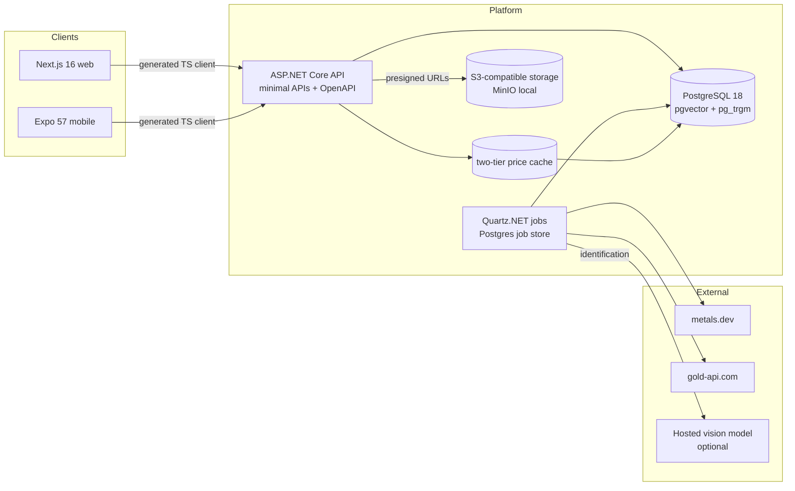

Full document: [docs/architecture.md](docs/architecture.md) · decisions: [docs/adr/](docs/adr/) (10 ADRs).

Animated system and identification flows (rendered with
[FlowInk](https://github.com/Alex5350/flowink), CSS-only animation,
GitHub-safe):

<p align="center">
  
</p>

<p align="center">
  
</p>

## Tech stack (exact, verified - [docs/versions.md](docs/versions.md))

| Layer | Choice | Version |
|---|---|---|
| Backend | ASP.NET Core minimal APIs, .NET 10 LTS | SDK 10.0.400 / runtime 10.0.11 |
| ORM / DB | EF Core 10 + Npgsql · PostgreSQL 18 + pgvector + pg_trgm | Npgsql.EF 10.0.3 · pgvector/pg18 |
| Jobs | Quartz.NET (Postgres store) | 3.19.1 |
| Auth | Identity + Argon2id + JWT + rotating refresh | NetDevPack Argon2 7.1.2 |
| API docs | Microsoft.AspNetCore.OpenApi + Scalar at `/docs` | 10.0.11 · 2.17.1 |
| Storage | S3-compatible (MinIO local) | AWSSDK.S3 4.0.102.4 |
| Telemetry | OpenTelemetry → OTLP | 1.18.0 |
| Web | Next.js App Router + React 19 + Tailwind v4 | 16.3.3 · 19.2.8 |
| Mobile | Expo Router + SecureStore + SQLite queue | SDK 57.0.17 / RN 0.86.3 |

## Prerequisites

- Docker (any runtime: Docker Desktop, colima, OrbStack) - `docker ps` works
- .NET SDK 10.0.400+ - `brew install dotnet-sdk` / [windows/linux downloads](https://dotnet.microsoft.com/download/dotnet/10.0)
- Node 22 LTS + pnpm 11 - `brew install node && corepack enable`
- (mobile only) Expo CLI + Xcode/Android toolchains - [Expo docs](https://docs.expo.dev/)

## Quickstart (clean machine, ~10 minutes)

```bash
git clone https://github.com/Alex5350/mintmark && cd mintmark
cp .env.example .env            # fill JWT key + provider keys (or run offline)
docker compose up -d            # postgres 18 + pgvector, minio, bucket init
just migrate                    # EF migrations
just seed                       # sourced catalog + demo user + demo holdings
just api                        # API on :5100 (docs at /docs)
# second terminal:
just web                        # web on :3100
```

Sign in as `demo@mintmark.local` / `mintmark-demo-2026`. Spot prices need a
metals.dev key (free, 100 req/mo); **without keys everything else works** -
identification runs the labeled offline evaluator and prices seed from
fixture history, flagged stale.

## Environment variables

Every variable is documented in [.env.example](.env.example) - name, default,
and how to obtain each key. Nothing real is committed.

## Running pieces independently

- API only: `just api` → http://localhost:5100, Scalar at `/docs`
- Web only: `just web` (needs API for data; renders empty states without)
- Mobile: `cd apps/mobile && pnpm expo start` - usage, offline behavior, and EAS build/submit in [apps/mobile/README.md](apps/mobile/README.md)
- Tests: `just test-backend` · `just test-web` · single test: `dotnet test --filter "FullyQualifiedName~GoldenValuation"` · `pnpm -C apps/web test -- HoldingCard`

## Common problems

| Symptom | Fix |
|---|---|
| `connection refused :5434` | `docker compose up -d db` - check `docker ps` shows mintmark-db healthy |
| NU1507 multi-source restore errors | use the repo's nuget.config (it clears machine sources); never add private feeds |
| Migration fails `type "vector" does not exist` | `just migrate` applies the extension migration first; ensure you're on the pgvector image, not stock postgres |
| Login 401 immediately | JWT signing key missing/short - generate `openssl rand -base64 48` into .env |
| Prices always stale | no provider key set - offline fixture prices are labeled stale by design |
| pnpm workspace resolution errors on mobile | run `pnpm install` from the repo root, not apps/mobile |

## Repository walkthrough

```
backend/    Mintmark.sln - Domain (zero deps) → Application (ports/use cases)
            → Infrastructure (EF, providers, storage, jobs) → Api (composition only)
apps/web    Next.js 16 client (Server Components default)
apps/mobile Expo SDK 57 client
packages/   api-client (generated from OpenAPI), domain-types, ui-tokens
prompts/    versioned vision prompt templates (identify-v1)
docs/       architecture, domain model, ADRs, valuation, runbook, versions
backend/seed/catalog.json   the sourced catalog (with _provenance block)
```

Contributing: [CONTRIBUTING.md](CONTRIBUTING.md) · License: MIT
([LICENSE](LICENSE)).

**Data attribution:** spot prices by [metals.dev](https://metals.dev.com)
(primary) and [gold-api.com](https://gold-api.com) (fallback), per the
licensing constraints in [ADR 0004](docs/adr/0004-price-providers.md).
Catalog specifications are cited per-row in
[backend/seed/catalog.json](backend/seed/catalog.json).
