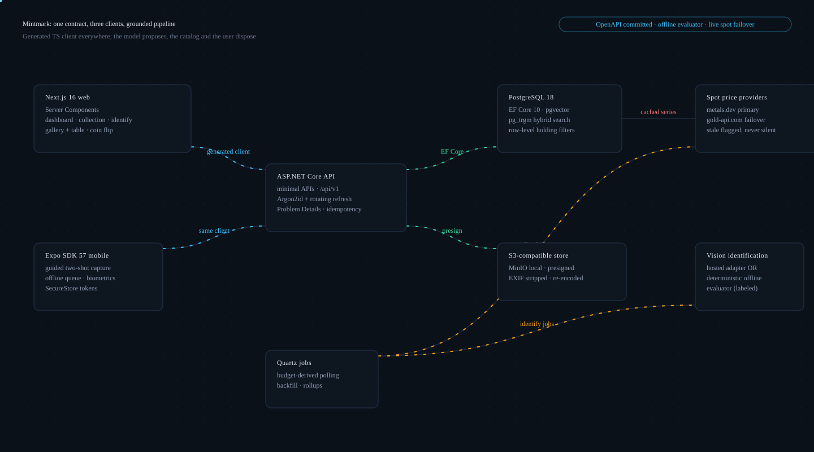
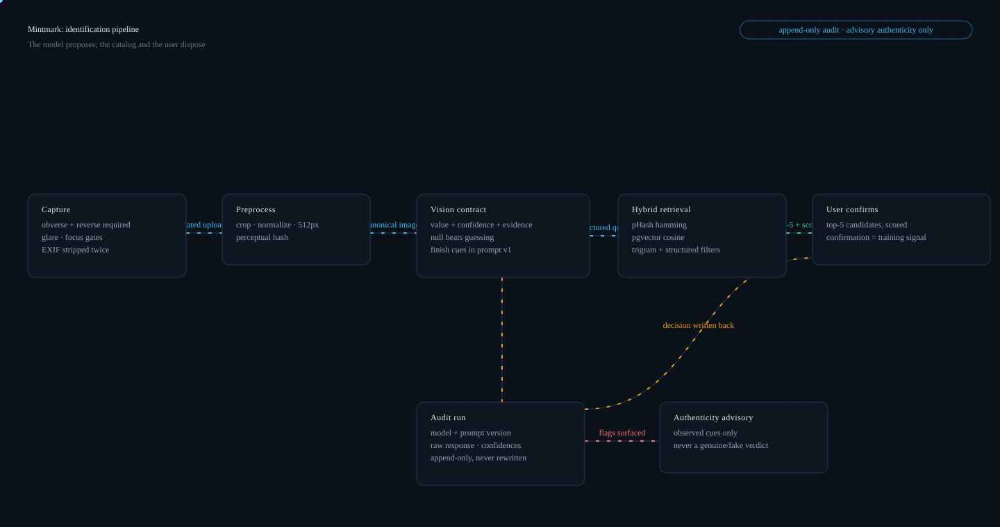
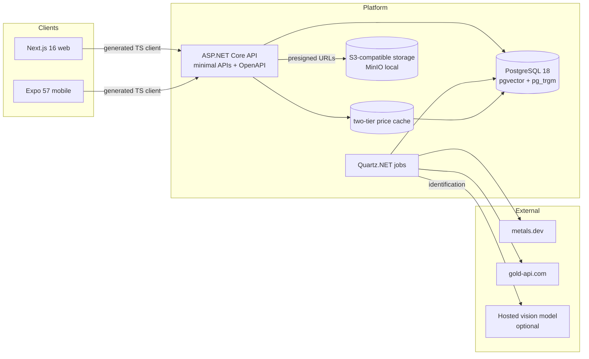

# Mintmark: the engineering view

The companion to the [README's product story](README.md): architecture, the request path
from photograph to dashboard, and every major engineering decision traced back to the
collector problem it exists to solve. ADRs and docs are linked throughout rather than
duplicated; [docs/GLOSSARY.md](docs/GLOSSARY.md) defines every term this page uses.

## Architecture

<p align="center">
  
</p>

<p align="center">
  
</p>

The animated diagrams above (rendered with [FlowInk](https://github.com/Alex5350/flowink),
CSS-only, GitHub-safe) are the visual companions; the Mermaid block below is the maintained
textual version ([docs/architecture.md](docs/architecture.md) is the source document, and
implementation changes go through ADRs).



Components in flow order:

- **Web client** (`apps/web`): Next.js 16 App Router, Server Components by default;
  dashboard, collection gallery + table, prices, identify.
- **Mobile client** (`apps/mobile`): Expo SDK 57; guided two-shot capture, durable SQLite
  offline queue, tokens only in SecureStore.
- **API**: ASP.NET Core minimal APIs under `/api/v1`, OpenAPI document generated from code
  and committed; both clients consume the same generated TypeScript client
  ([ADR 0008](docs/adr/0008-rest-first.md)).
- **PostgreSQL 18** with pgvector (embedding similarity) and pg_trgm (legend text search);
  row-level query filters scope every holding by user.
- **S3-compatible object storage** (MinIO locally): coin photographs live only here,
  behind presigned expiring URLs ([ADR 0006](docs/adr/0006-object-storage-s3-compatible.md)).
- **Quartz jobs**: spot polling with budget-derived interval, history backfill, nightly
  rollups.

Repository layout:

```
backend/    Mintmark.sln - Domain (zero deps) → Application (ports/use cases)
            → Infrastructure (EF, providers, storage, jobs) → Api (composition only)
apps/web    Next.js 16 client (Server Components default)
apps/mobile Expo SDK 57 client
packages/   api-client (generated from OpenAPI), domain-types, ui-tokens
prompts/    versioned vision prompt templates (identify-v1)
docs/       architecture, domain model, ADRs, valuation, runbook, versions
backend/seed/catalog.json   the sourced catalog (with _provenance block)
```

**Layering rule:** Domain → Application → Infrastructure → Api, with Api the only
composition root. The dependency direction is enforced by an architecture test
(ArchUnitNET) that fails the build, not by convention alone.

## How the tech solves the business problem

| Business problem | Engineering decision | Why this tech | What it buys | Where documented |
|---|---|---|---|---|
| Live spot prices at hobbyist request budgets (100-300/month) | Composite provider: metals.dev primary, gold-api.com failover; one `/v1/latest` call returns gold, silver, platinum and palladium together | One request per refresh, not two; no mandatory third-party branding (MetalpriceAPI was rejected for required visible attribution) | All four metals refresh for one request; each stored price row records which provider actually served it | [ADR 0004](docs/adr/0004-price-providers.md) |
| Collectible estimates must be honest with zero training data | Rules-based premium model: collectible = melt × product of inspectable factors; weights are reference data; confidence band and method version on every estimate | Machine learning on zero training data produces confident garbage | Estimates explainable line-by-line; tuning is data, not deploys; golden tests freeze outputs | [ADR 0007](docs/adr/0007-valuation-rules-first.md), [docs/valuation.md](docs/valuation.md) |
| A leaked refresh token must not become a skeleton key, on a phone | JWT access tokens (15 min) + opaque 256-bit single-use rotating refresh tokens, hashed at rest; reuse revokes the whole family; Argon2id passwords; mobile tokens in SecureStore only | Short access life bounds exposure; rotation + family revocation bounds refresh theft; no server-side sessions to hold | Theft of any consumed token is a revocation signal; the phone holds nothing long-lived and valuable | [ADR 0005](docs/adr/0005-auth-token-strategy.md) |
| Coin photographs are heavy, sensitive (EXIF/GPS), and evidence | S3-compatible object storage, private bucket, presigned expiring URLs, mandatory server-side re-encode | No image bytes in Postgres; leaked URLs expire; the re-encode strips EXIF/GPS as a side effect | Photos are preserved for the audit trail (every IdentificationRun references its image keys) without becoming a leak surface | [ADR 0006](docs/adr/0006-object-storage-s3-compatible.md) |
| The system, CI, and the 10-minute quickstart must run without provider keys | Deterministic offline evaluator behind the `IVisionIdentifier` port, pHash-matched against seeded reference images, every response labeled `provider: "offline"` | The brief bans silent stubs: faking model output would be dishonest | The entire pipeline (capture → retrieval → confirm → audit) is exercisable with zero keys and zero spend; a real key changes one config value | [ADR 0009](docs/adr/0009-offline-vision-evaluator.md), [docs/ai-pipeline.md](docs/ai-pipeline.md) |
| Two clients (web, mobile) must not drift from the API | REST + OpenAPI document committed and diffed in CI; the TypeScript client both frontends consume is generated from it; no hand-written fetch calls | One contract, two clients, zero drift by construction | Breaking changes surface as reviewable diffs; the mobile app once crashed on exactly this class of drift | [ADR 0008](docs/adr/0008-rest-first.md) |
| A high-relief reverse proof is two facts, not one | Finish modeled as primary finish + independent attribute flags | A flat enum forces combined-value explosion or lossy single-choice storage | Combination coins are representable; the vision contract reports primary and flags separately, matching how the model perceives fields vs devices | [ADR 0003](docs/adr/0003-finish-modeling.md) |

The row that shaped the product most: valuation rules first. The tempting path was a
learned model; with no realized-sale data to train on, it would have produced confident
garbage dressed as precision. Instead every collectible estimate is a product of factors a
collector can read (mintage tier, finish, grade, series demand, age), each carrying a
rationale, wrapped in a confidence band that widens as more factors apply. The proof is
the divergence test, frozen as a golden: at silver $28.50/ozt, a common-date BU
Eagle-style coin (mintage 14M) values at $28.50 melt, 1.0000x collectible, while a 2 oz
reverse-proof high-relief Libertad-style coin (mintage 1,800, MS70, high demand) values at
$57.00 melt and $792.8928 collectible, a 13.9104x multiplier and a 27.8x collectible gap.
That gap falls out of the factor product (3.0 × 1.8 × 1.15 × 1.6 × 1.4) with zero special
cases in code, and the golden test fails if anyone hardcodes it.

## Request and data flow

One representative path: from photographing a coin to the dashboard reflecting it.

1. **Capture (phone).** Guided two-shot: frame the obverse in the overlay (glare/focus
   feedback, retake if needed), flip, photograph the reverse. Capture gates reject blurry,
   glared, low-resolution images before a doomed model call is ever paid. EXIF, including
   GPS, is stripped client-side.
2. **Submit.** Upload goes through presigned PUT after server-side content validation;
   the server re-encodes every image, stripping EXIF again. The request carries an
   idempotency key so a flaky-network double-submit cannot create duplicate runs. Submit
   returns a job id immediately; no request ever blocks on a model call.
3. **Identify, stage by stage** ([docs/ai-pipeline.md](docs/ai-pipeline.md)):
   preprocess (crop/deskew/normalize to a 512px canonical PNG, perceptual hash) → vision
   contract (strict JSON: every field is value + confidence + evidence; a field without
   visual evidence returns null, never a guess; served by the hosted adapter or the
   labeled offline evaluator) → hybrid retrieval, which refuses to trust free text as an
   answer: the vision output becomes queries (pHash distance ∥ pgvector cosine ∥ pg_trgm
   on legends ∥ structured filters for metal, year ±2, actual-metal-weight band).
4. **Confirm.** The collector sees the top five catalog candidates with scores and
   confirms one; the confirmation is written back to the append-only `IdentificationRun`
   audit row (model + prompt-template version, raw response, per-field confidences,
   candidates, timestamps). Never skipped.
5. **Value.** The confirmed catalog match types the holding. Melt = actual metal weight ×
   quantity × spot (never gross weight); collectible = melt × the factor product;
   persisted as `Valuation` rows stamped `rules-v1` with the spot row and provider they
   derived from.
6. **Roll up.** The dashboard aggregates valuations server-side against the same cached
   spot the ticker shows (the +67.7% class of figure traces to that spot), stale flags
   propagate end to end (API field, web badge, mobile badge), and history charts are
   downsampled server-side: LTTB for long ranges, bucketed averages for short.

## Stack, and why

Exact versions verified and recorded in [docs/versions.md](docs/versions.md); bumping
anything requires updating that file in the same change.

| Layer | Choice | Version | Why / where documented |
|---|---|---|---|
| Backend | ASP.NET Core minimal APIs, .NET 10 LTS | SDK 10.0.400 / runtime 10.0.11 | Minimal APIs grouped as endpoint modules; no MVC controllers ([ADR 0002](docs/adr/0002-backend-aspnet-core.md)) |
| ORM / DB | EF Core 10 + Npgsql · PostgreSQL 18 + pgvector + pg_trgm | Npgsql.EF 10.0.3 · pgvector/pg18 | Hybrid retrieval (vector + trigram) in one database; row-level holding filters |
| Jobs | Quartz.NET | 3.19.1 (one step back from 3.20.0 deliberately) | Budget-derived polling interval, backfill, rollups; job-store caveat tracked in [open questions](docs/open-questions.md) |
| Auth | Identity + Argon2id + JWT + rotating refresh | NetDevPack Argon2 7.1.2 | [ADR 0005](docs/adr/0005-auth-token-strategy.md) |
| API docs | Microsoft.AspNetCore.OpenApi + Scalar at `/docs` | 10.0.11 · 2.17.1 | Swashbuckle deliberately absent ([ADR 0002](docs/adr/0002-backend-aspnet-core.md)) |
| Storage | S3-compatible (MinIO local) | AWSSDK.S3 4.0.102.4 | Swappable endpoint (MinIO → S3 → Azure Blob) ([ADR 0006](docs/adr/0006-object-storage-s3-compatible.md)) |
| Telemetry | OpenTelemetry → OTLP | 1.18.0 | Endpoint-configured, no vendor lock |
| Web | Next.js App Router + React 19 + Tailwind v4 | 16.3.3 · 19.2.8 | Server Components by default |
| Mobile | Expo Router + SecureStore + SQLite queue | SDK 57.0.17 / RN 0.86.3 | Camera-first client; [apps/mobile/README.md](apps/mobile/README.md) |

## Testing

126 backend tests across three suites, each protecting something specific:

- **46 domain tests** on zero-dependency rules: `Money` (cross-currency throws), `Weight`
  (the one conversion site, 1 ozt = 31.1034768 g), holding revision history,
  identification-run invariants.
- **72 application tests**: the golden valuations, including the divergence golden
  (frozen decimals above; any factor change is a deliberate, reviewed diff per
  [ADR 0007](docs/adr/0007-valuation-rules-first.md)), premium-factor table, validators,
  prompt-catalog, and the architecture layering tests that fail the build on a dependency
  violation.
- **8 integration tests**: WebApplicationFactory + Testcontainers against the real
  `pgvector/pgvector:pg18` image (never the in-memory provider, which is banned): health,
  register/login problem details, and the security test that proves the row-level holding
  filter holds even with endpoint authorization removed.

CI runs on every push: backend tests, web lint + build, the mobile strict typecheck (the
contract-alignment canary that once caught real drift), and the OpenAPI diff: the document
and the generated TypeScript client are regenerated and the build fails on drift.

## Security and operations

Posture target is OWASP ASVS Level 2, tracked item by item (done / not applicable /
deferred with reasons) in [docs/security.md](docs/security.md):

- Argon2id password hashing (Identity's default PBKDF2 replaced); 12+ char policy with a
  breached/common denylist.
- 15-minute JWTs, single-use rotating refresh tokens hashed at rest, family revocation on
  reuse ([ADR 0005](docs/adr/0005-auth-token-strategy.md)).
- Row-level scoping of every holding query by user, proven by a defense-in-depth test
  with endpoint authorization removed.
- Uploads: magic-byte content sniffing, size caps, server-side re-encode (strips
  EXIF/GPS and embedded payloads), presigned expiring URLs only, private bucket
  ([ADR 0006](docs/adr/0006-object-storage-s3-compatible.md)).
- The collection-privacy rule: the app knows what metal a person owns and where they keep
  it, so storage location is unindexed, excluded from default exports, and never logged.
  Deferred with reasons: column-level encryption at rest, the networked breached-password
  check, production deployment posture (all in [open questions](docs/open-questions.md)).
- Per-IP auth rate limits, per-user daily identification limits, idempotency keys on
  mutations.
- Operations: [docs/runbook.md](docs/runbook.md) covers deploy (migrations deliberate,
  never auto-applied in production), provider-outage behavior (failover, then stale
  flagged by design), key rotation, and investigating a bad identification through the
  append-only run.

## Running the pieces

- API only: `just api` → http://localhost:5100, Scalar at `/docs`
- Web only: `just web` (needs API for data; renders empty states without)
- Mobile: `cd apps/mobile && pnpm expo start`; usage, offline behavior, and EAS
  build/submit in [apps/mobile/README.md](apps/mobile/README.md)
- Tests: `just test-backend` · `just test-mobile` (typecheck) · single test:
  `dotnet test --filter "FullyQualifiedName~GoldenValuation"`

### Common problems

| Symptom | Fix |
|---|---|
| `connection refused :5434` | `docker compose up -d db`; check `docker ps` shows mintmark-db healthy |
| NU1507 multi-source restore errors | use the repo's nuget.config (it clears machine sources); never add private feeds |
| Migration fails `type "vector" does not exist` | `just migrate` applies the extension migration first; ensure you're on the pgvector image, not stock postgres |
| Login 401 immediately | JWT signing key missing/short: generate `openssl rand -base64 48` into .env |
| Prices always stale | no provider key set: offline fixture prices are labeled stale by design |
| pnpm workspace resolution errors on mobile | run `pnpm install` from the repo root, not apps/mobile |

## Jargon

Terms used across this repo, from [troy ounce](docs/GLOSSARY.md) to
[LTTB downsampling](docs/GLOSSARY.md), are defined in the
[glossary](docs/GLOSSARY.md): collector terms first, engineering terms second, plain
English before precision.
