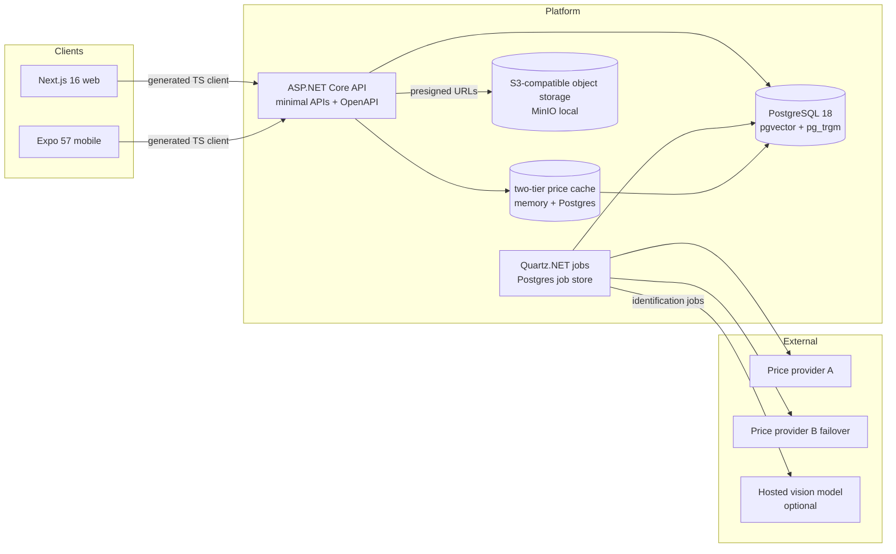

# Mintmark architecture

Phase 0 deliverable. Implementation must match; changes go through ADRs.



## Layers

Strict dependency direction, enforced by an architecture test that fails
the build:

```
Mintmark.Domain          → nothing          (entities, value objects, services)
Mintmark.Application     → Domain           (use cases, ports, validators)
Mintmark.Infrastructure  → Application, Domain (EF Core, providers, storage, jobs)
Mintmark.Api             → all              (the ONLY composition root)
```

## Request flow

Web (Server Components by default) and mobile consume the same generated
TypeScript client (`packages/api-client`, built from the committed OpenAPI
document; breaking API changes fail CI as a document diff). Mutations from
mobile carry idempotency keys (flaky-network double-submits must not create
duplicate holdings).

## Spot price pipeline

1. **Poller** (Quartz, Postgres job store; survives restarts) fetches
   `IMetalPriceProvider` (composite: primary → failover, recording which
   provider served each row). Interval is **computed from the configured
   monthly budget** with headroom, and slows outside metals market hours.
2. **Cache**: in-memory (short TTL) over Postgres (authoritative). Clients
   are always served from cache; only the poller touches providers. A
   provider outage serves the last known good price **flagged `stale`**
   end-to-end: API field, web badge, mobile badge. Stale is never silent.
3. **History**: daily closes backfilled on first run (`SpotPriceDaily`).
   Chart endpoint downsamples server-side: **LTTB** for 3M-5Y/MAX point
   series, **bucketed averages** for 1D/1W/1M. The gold-to-silver ratio is
   a first-class derived series. Retention: raw ticks roll up to daily after
   90 days (nightly job), daily closes kept forever: bounded tick table,
   permanent charts.

## Identification pipeline (async by design)

Submit (both obverse + reverse required after capture gates) →
preprocess (crop/deskew/normalize + canonical square, EXIF-stripped) →
vision call (hosted adapter or the offline evaluator, ADR 0009) →
embedding + **hybrid catalog retrieval** (pgvector similarity ∥ trigram
legend matching ∥ structured filters) → top-5 candidates → user confirms →
`IdentificationRun` append-only audit row. Clients poll a job status;
no request ever blocks on a model call.

## Valuation

Computed on read for portfolio rollups (in-database aggregation), persisted
as `Valuation` rows with method version + spot provenance for history.
Factors/weights are reference data (ADR 0007). Golden tests freeze outputs.

## Observability

OpenTelemetry traces/metrics/logs with OTLP export (endpoint-configured, no
vendor). Structured logging never carries tokens, passwords, image bytes,
or storage-location strings (privacy rule, docs/security.md).
