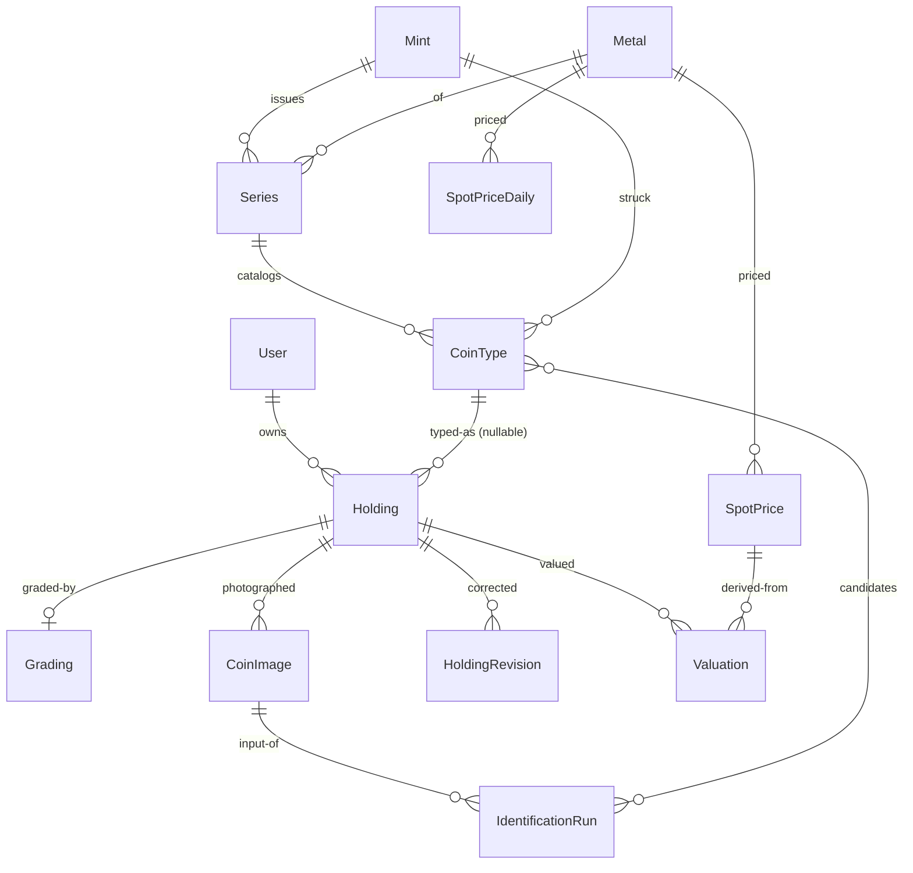

# Mintmark domain model

The domain is the product. This document is the Phase 0 deliverable for the
data model; implementation lives in `backend/src/Mintmark.Domain` and must
match it. Entity diagram at the end.

## Reference data (shared catalog)

**Metal**: Gold, Silver, Platinum, Palladium. Ships four even though v1
features gold and silver only.

**Mint**: name, country, ISO country code, `mint marks` (one-to-many: a
mint has several: `Mo` Mexico City; `W`, `S`, `P`, `D` US), founded year,
active flag, notes, logo asset key. Seeded with the fourteen mints listed in
the master brief.

**Series** (mint, metal): American Silver Eagle, Libertad, Maple Leaf,
Philharmonic, Britannia, Krugerrand, Morgan Dollar, Peace Dollar, … Design
metadata + the date range the series has run.

**CoinType**: the canonical catalog row, one per series × year × size ×
finish × mint-mark combination. Carries fineness (0.999), **gross weight
(g)**, **actual metal weight (troy oz, ASW/AGW; the only number melt value
ever uses)**, diameter/thickness (mm), edge type, finish, mintage figure +
source URL, catalog references (KM, Red Book), obverse/reverse reference
image keys. **Every specification row carries a source URL; disputed or
unavailable figures stay null** (hard rule, enforced by a seed validator).

**Finish**: modeled as a primary finish plus attribute flags, not a flat
enum: a high-relief reverse proof is two facts, not one.
- Primary: `BusinessStrike | BullionUncirculated | Proof | ReverseProof |
  Burnished | MatteProof | Unknown`
- Flags: `HighRelief`, `Enhanced`, `Colorized`, `Antiqued`, `FirstStrike`
ADR 0003 records why.

## User data

**Holding**: one owned item (or a lot of identical items): user, coin type
(nullable for generic bars/rounds), `ItemForm`
(`Coin|Round|Bar|Ingot|JunkSilver|Scrap|Jewelry`), quantity, purchase date,
**purchase price per unit (immutable: corrections are new revisions)**,
dealer, storage location (sensitive; see security doc), serial number,
packaging state, notes, soft-delete.

**HoldingRevision**: append-only correction history for price/quantity.

**Grading** (optional, 1:1): service (NGC/PCGS/ANACS/ICG/raw), numeric
grade, designations (`Ultra Cameo`, `Early Releases`…), cert number, label
pedigree, verification URL.

**CoinImage**: holding, side (`Obverse|Reverse|Edge|Slab|Other`), storage
key, capture metadata, **perceptual hash** (dedupe), **embedding vector**
(pgvector; catalog matching).

**IdentificationRun**: the audit backbone. Input image refs, model name +
version, prompt template version (files in `/prompts`, versioned), raw
structured response, per-field confidence, candidate matches with scores,
user confirmation/correction, timestamps. **Append-only. Never skipped.**

## Market data

**SpotPrice**: metal, currency, price/troyoz, bid, ask, provider, source
timestamp, ingested-at. Time-series; partitioned/rolled up per the retention
policy in `docs/architecture.md`.

**SpotPriceDaily**: historical daily closes (backfilled on first run so
charts are never empty on day one).

**Valuation**: holding, type (`Melt|Collectible`), value + currency, the
spot row it derived from, method + method version, confidence band,
computed-at. Historical valuations stay explainable forever.

## Value objects and rules

- `Money`: decimal amount + currency; cross-currency arithmetic throws at
  the type level. `double`/`float` for money is a build error by convention
  (reviewed, not enforced by the compiler; documented in CONTRIBUTING).
- `Weight`: magnitude + unit (`Grams|TroyOunces`); one conversion site, the
  exact factor `1 ozt = 31.1034768 g`, unit-tested against known values.
- Strongly typed IDs (`HoldingId`, `CoinTypeId`, …): argument transposition
  is a compile error.
- All timestamps `timestamptz` UTC; conversion only at the presentation edge.
- Invariants live in constructors/factories, never in endpoints.

## Entity diagram

